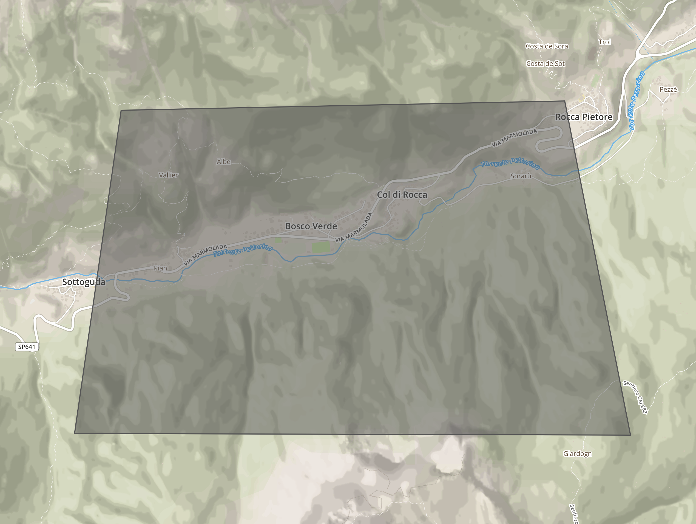
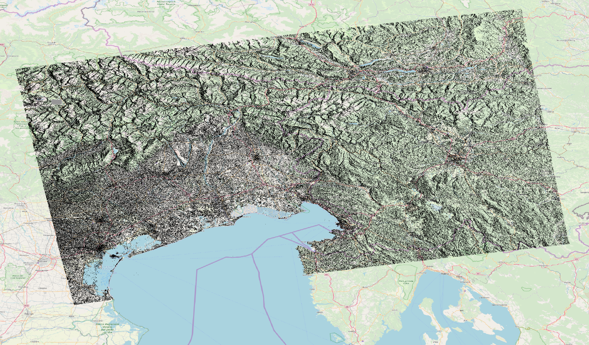
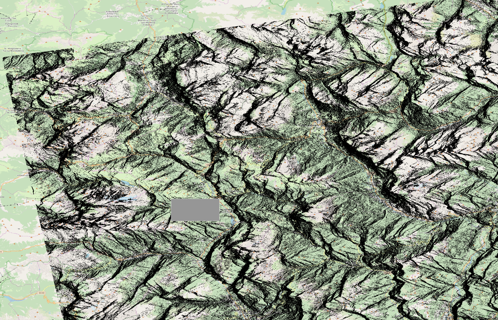
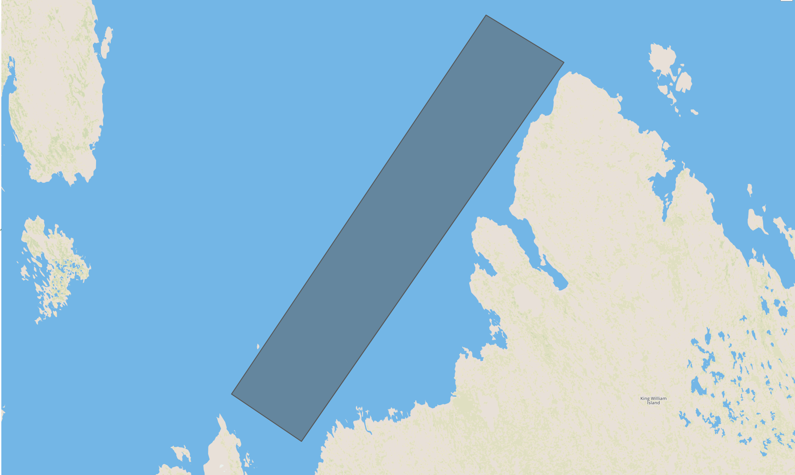
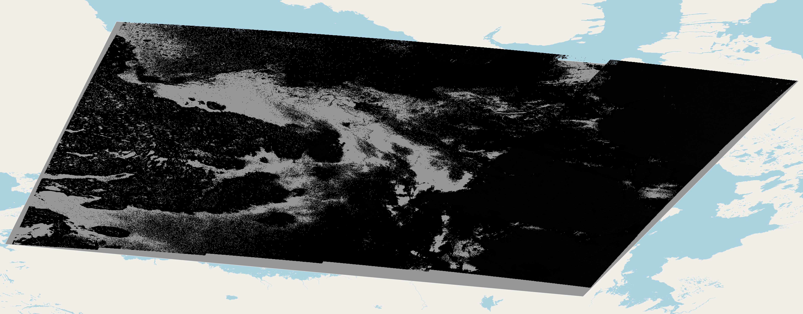

.. meta::
   :description: UP42 going further: data filters
   :keywords: data querying, STAC, data filters, data blocks

.. _filter-tutorial:

======================
 Data filter tutorial
======================

There are multiple ways to query for data in a :term:`data block`. You can
filter by:

 1. Geometry: use the AOI definition as a filter.
 2. Time/date: use a date, date range and/or a time series.
 3. Product IDs: each returned image as a specific product ID, which
    in some cases might coincide with the :term:`scene` ID for blocks
    that provide :term:`full scene`, or just an unique ID coming from the
    upstream data provider.

These are the filters used for querying the upstream data provider,
additionaly you may limit the number of returned data assets using
the :ref:`limit <limit-filter>`. By default a single data asset is
returned.
    
Filtering by geometry
---------------------

Generally you have a very concrete idea of the area of Earth that
interests you for the particular application you have in mind. To  
select for a piece of data relative to that area you specify an
:term:`AOI`.

UP42 provides two types of output depending on the
chosen data block :ref:`capabilities <block-capabilities>`:
:term:`AOI clipped` and :term:`full scene`.

Three type of situations might happen given an AOI:

 1. You want to have data that **intersects** the AOI.
 2. You want to have data that fully **contains** the AOI.

Get the data that intersects the AOI
++++++++++++++++++++++++++++++++++++

To explain the ``intersects`` geometry filter we are going to use both 
full scene and AOI clipped blocks. For simplicity sake we are going to
be using the same AOI. 

Original AOI to be used in all examples
      
Full scene block example
^^^^^^^^^^^^^^^^^^^^^^^^

For this example we are using the following job parameters:

.. _aoi-filter-tutorial:

.. gist:: https://gist.github.com/up42-epicycles/357d5fc94627c60cb152749582a172cc

And here are the two returned images in VV and VH polarization.
          

Sentinel 1 scene returned for VH polarization
         
.. figure:: _assets/filters-s1-l1c-grd-vv.png
   :align: center
   :alt: Sentinel 1 L1C GRD VV polarized scene in northern Italy  

Sentinel 1 scene returned for VV polarization

The AOI is barely visible in the images above. If you zoom in you can
see it clearly as a grey rectangle superimposed on the image. 

AOI detail in the VH polarization full scene         

Since for full scenes the returned image covers an area much larger
than the AOI it will fully contain the AOI even if you specify
``intersects``.

This changes if you use a large AOI. In the example the AOI covers an
area of 2342.5 km².

.. gist:: https://gist.github.com/up42-epicycles/756ed89740eef063dcd086905b24cf45

.. warning::
   Please be aware that for specifying such a large AOI you
   need to Mail to `mail us <mailto:support%20@up42.com>`__ enable
   this in a particular project. By default after adding a payment
   method to your account the maximum allowed AOI area is currently
   set to be 1000 km². Without a payment method is 100 km².

Large AOI with 2342.5 km² area in northern Canada
         

  
Sentinel 1 scene for HH polarization intersecting the large AOI in
northern Canada 

You can see that the AOI, represented in the gray rectangle under the
satellite image, you can see the gray, hence the image does not fully
covers the API in this case due to the large dimension of the AOI.

AOI clipped block example
^^^^^^^^^^^^^^^^^^^^^^^^^

The other type of blocks we have are AOI clipped. This means that that
the returned image will be composed of `tiles
<https://en.wikipedia.org/wiki/Web_Map_Tile_Service>`_, or a single
image in the case of the :term:`download block`, that **intersect**
the given AOI.

Let us consider the same AOI given :ref:`above
<aoi-filters-tutorial>`. We are going to use the very-high resolution
data from Pléiades, with both the :ref:`download
<pleiades-download-block>` and :ref:`streaming
<pleiades-aoiclipped-block>` blocks.

Filtering by time/date
----------------------

Filtering by date range
+++++++++++++++++++++++

Filtering by time series
++++++++++++++++++++++++

Filtering by IDs
----------------

Filtering by product ID
+++++++++++++++++++++++

Filtering by scene ID
+++++++++++++++++++++

Filtering by limit
------------------
